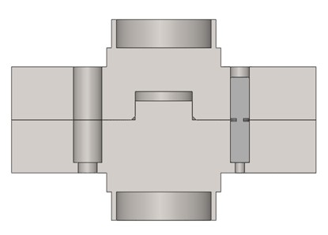

# Eugene Jeong
This is a collection of images of my mechanical engineering projects.

## Shear pin hub (Baja SAE team)

Shear pin hub on driveshaft | Installed on car
-- | --
 | 

I designed, machined, and installed this assembly which tests the maximum torque through a driveshaft by destruction of a shear pin. Below is a CAD model which shows a cross sectional view of a pin resting in its bore.

## Continuously variable transmission assembly tool (Baja SAE team)

CVT placed in custom tool | Side view of tool
-- | --
 | 

I designed and manufactured this tool which was intended to aid in assembly of a CVT pulley. The tool didn't quite work as planned, but the process of making it taught me valuable lessons in designing something to be sturdy, useful, and easy to make.

## CNC manufacturing (Baja SAE team)

CVT cam | Brake and steering brackets | Steering rack parts
-- | -- | --
 |  | 

I manufactured these parts, and others, on a Tormach PCNC 770.

## Waving cat (Mechatronics Class)

View of finished project | Internals
-- | --
 | 

I designed and built an interactive waving cat statue that responded to external input like patting on the head.

## Metal additive manufacturing surface analysis

I wrote MATLAB code to identify particle boundaries on a surface created by laser powder bed fusion. This image shows the result of one segmentation method compared to a reference classification result.

## Die attach voiding analysis (Undergraduate Research)

I used ANSYS Workbench to conduct parametric studies to determine the effect of void number and size on the thermal resistance and maximum temperature in a die attach layer.

## Pressure sensor (Micro Sensors Class)

COMSOL result | Plot of parametric study
-- | --
 | 

I designed a capacitive sensor from deformation equations, created a process flow and 3D model using L-Edit and MEMS Pro, and studied the effect of the geometry on deformation using COMSOL.
